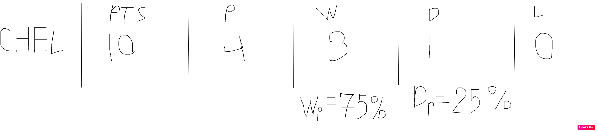
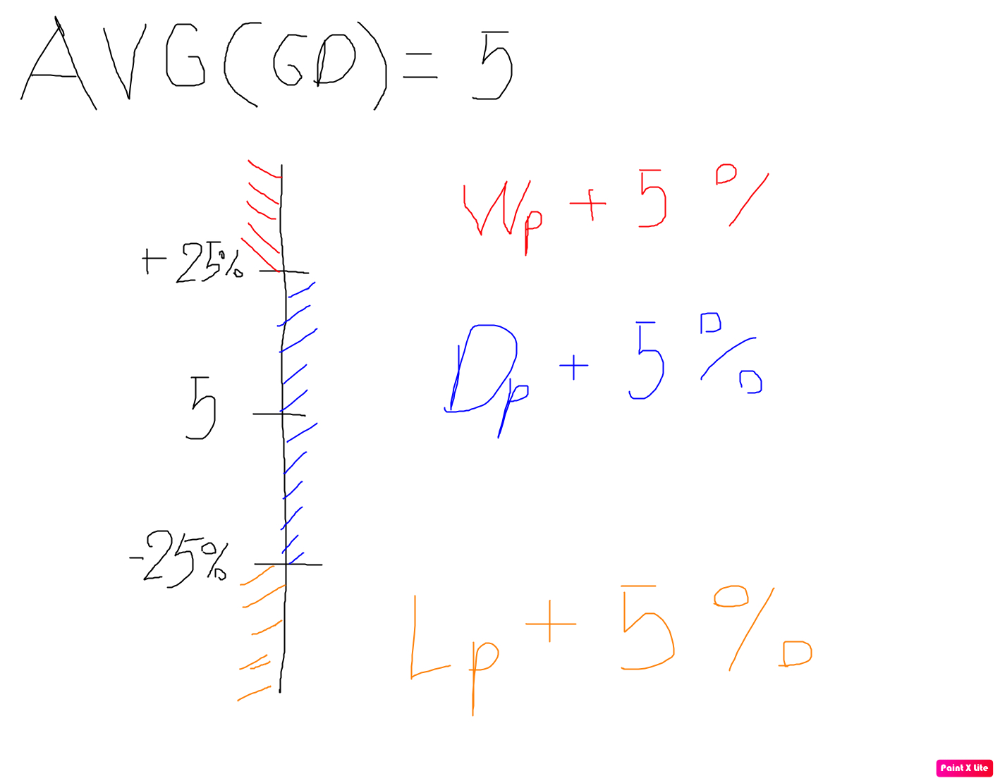
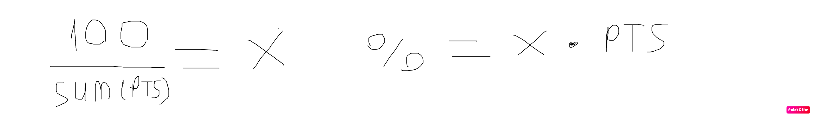

## How It Works

In the first step we calculate percent for
WON mark as Wp (Won Percent)
Drawn mark as Dp (Drawn Percent)
Lost mark as Lp (Lost Percent)

### percent = plays / (won or drawn od lost)

in the next step we calculate average goal difference AVG(GD)

if GD > AVG(GD) + 25% then add to Wp + 5%

if GD < AVG(GD) - 25% then add to Lp + 5%

else add to Dp + 5%

in the last step we calculate Percent per Point and championship prediction

